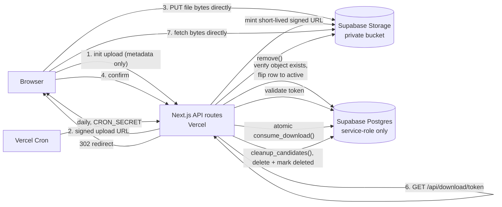

# Crate Link — Architecture

Personal, temporary (or permanent-on-request) file sharing. Upload a file,
get a short-lived link + QR code, share it; it stops working when it expires,
hits its download limit, or the file is deleted from storage — whichever
happens first, enforced logically at request time, independent of whether
background cleanup has run yet.

## 1. System overview



**File bytes never pass through the Vercel function** on either upload or
download — only metadata and short-lived, single-purpose signed
URLs/tokens do. This is the central architectural decision and it drives
most of what follows.

## 2. Why direct-to-storage, not server-mediated upload/download

The brief's own options were: server-mediated upload, presigned/signed
upload URLs, Supabase SDK, or the S3-compatible API. Evaluated:

- **Server-mediated upload/download (proxy bytes through a Vercel function)**
  was rejected. Vercel's platform request body limit for serverless/edge
  functions is a hard ceiling regardless of plan, and a proxy also doubles
  bandwidth cost (client → Vercel → Supabase, then again in reverse for
  downloads) and ties up a function for the full transfer duration. For a
  file-transfer tool, the file size is exactly the thing that shouldn't be
  bounded by an unrelated platform limit.
- **Supabase's S3-compatible API** was rejected in favor of the native
  Supabase Storage SDK. The S3-compatible endpoint exists mainly for tools
  that already speak the S3 protocol (e.g. rclone, existing S3 SDKs). Since
  this is a from-scratch Next.js app already using `@supabase/supabase-js`
  everywhere else (database, storage), using the native Storage API for
  everything is simpler — one client library, one auth model, one place to
  reason about credentials — with no offsetting benefit from the S3 shim.
- **Signed upload URLs + signed download URLs, both minted server-side**
  is what's implemented. The server (holding the service-role key) is the
  only thing that can mint them; the browser gets short-lived Supabase
  anon-key + Storage SDK access, but only to the one object a signed token
  explicitly authorizes.

Consequence: **the browser never receives the service-role key**, and the
one credential it does get (the anon key) has no table access at all (see
§6) and no general storage access — only what a specific signed
token/URL grants for a specific object, for a short time.

## 3. Where each operation happens

| Operation | Where | Why |
|---|---|---|
| Pick file, choose expiration/limit | Browser | Pure UI |
| Validate size/expiration/limit, sanitize filename, generate token, insert DB row, mint signed upload URL | Vercel server (`/api/upload/init`) | Needs the service-role key; never trust client-declared size/type alone |
| Upload file bytes | Browser → Supabase Storage directly | Avoids proxying through Vercel; the signed token is the only thing authorizing this specific write |
| Verify object landed, flip row to `active` | Vercel server (`/api/upload/confirm`) | Needs the service-role key to read/write the DB; independently confirms the upload actually completed |
| Validate token + show file info | Vercel server, SSR (`/f/[token]`) | DB is only ever reachable server-side |
| Atomically consume a download slot | Vercel server (`/api/download/[token]`), via a Postgres function | Needs service-role key + must be a single atomic statement (race safety, §8) |
| Mint short-lived signed download URL | Vercel server | Needs the service-role key |
| Fetch file bytes | Browser → Supabase Storage directly (redirected) | Avoids proxying; URL expires in 60s and is single-purpose |
| Promote to permanent | Vercel server (`/api/keep-permanent/[token]`) | Needs service-role key; atomic guard against concurrent cleanup |
| Delete expired objects + mark rows deleted | Vercel server (`/api/cron/cleanup`), triggered by Vercel Cron | Needs service-role key; runs on a schedule, not in the request path |

## 4. Database schema

One table. See `supabase/migrations/0001_init.sql` for the authoritative
definition (constraints, indexes, and the two SQL functions below).

```
files
  id                uuid primary key
  token_hash        text unique          -- sha256(public token), see §6
  storage_path      text unique          -- e.g. "temp/<random>" / "perm/<random>"
  original_filename text
  mime_type         text
  size_bytes        bigint
  created_at        timestamptz
  expires_at        timestamptz nullable -- null only once is_permanent = true
  is_permanent      boolean
  status            text  -- 'pending' | 'active' | 'deleted'
  download_count    integer
  max_downloads     integer nullable     -- null = unlimited
```

**Why this schema and not the brief's suggested one verbatim:** the brief
listed a longer, more state-machine-heavy shape as an example
(`uploading / active / permanent / expired / deleting / deleted / failed`,
plus a separate "permanent flag / equivalent state"). Section 16 of the
brief explicitly says to use only states that are actually necessary. Here:

- `expired`, `deleting`, and `failed` are not separate **stored** states —
  they're derived at read time from `expires_at`/`max_downloads` vs. now(),
  or represented by simply *not* transitioning a row (a storage-delete
  failure just leaves the row `active`, to be retried — see §8 Case D/E).
  Storing them as literal enum values would let the DB and reality disagree
  (e.g. a row stuck in `deleting`) instead of the row always being an honest
  reflection of the last confirmed step.
- `is_permanent` is a boolean, not a `status` value, because permanence and
  lifecycle status are orthogonal — a permanent file is still `active` in
  every other sense (downloadable, has a `download_count`, etc.).
- Three `status` values are sufficient: `pending` (row exists, upload not
  yet confirmed), `active` (downloadable, subject to expiry/limit checks),
  `deleted` (terminal).

## 5. Storage architecture

Single private bucket, `droplink`, never made public. Two logical prefixes:

```
temp/<random>   -- newly uploaded, subject to expiry cleanup
perm/<random>   -- promoted via "Keep Permanently"
```

The random suffix is generated independently of the public share token
(`lib/token.ts: generateStorageKey`) and is never derived from the
user-supplied filename. **Path traversal is structurally impossible here,
not just filtered** — nothing about the filename ever reaches the storage
path construction at all.

`storage_path` is stored in full on the row (not derived from
`is_permanent` at read time) specifically so that a failed temp→perm move
(§8 Case B) can't produce a row whose flag says one thing while the object
is actually somewhere else — the row always points at wherever the object
actually is.

The public URL is always `/f/<token>` (§7); the underlying storage path is
never exposed to the client, in the QR code, or in any response body.

## 6. Token design: hashed, not stored raw

The public token is 256 bits from `crypto.randomBytes`, base64url-encoded
(`lib/token.ts`). It is returned to the uploader exactly once, in the
`/api/upload/init` response, and is never persisted.

What's stored in the database is `sha256(token)`. Tradeoff considered:

- **Cost:** one cheap SHA-256 digest per request, looked up via a unique
  index on `token_hash` — no measurable performance difference from storing
  the raw token.
- **Benefit:** if the database is ever read by someone who shouldn't
  (backup exposure, a future bug elsewhere in the app, an overly broad
  support/debugging query), they get 64-char hex digests, not working
  download links. A raw-token design would turn "someone can read the
  files table" directly into "someone can download every temporary file
  ever uploaded."

Given the cost is negligible and the benefit is exactly the kind of
credential-exposure risk called out in the brief's threat model, hashing is
the strictly better choice here — there's no real tradeoff to make.

Row Level Security is enabled on `files` with **no policies defined**,
which means default-deny for `anon`/`authenticated` — the browser's
Supabase client (built with the anon key) cannot read or write this table
under any circumstance. Only the service-role key (server-side only)
bypasses RLS. The browser never queries the database at all; it only ever
talks to Supabase Storage, and only via signed tokens.

## 7. Public URL & QR code

```
https://<site>/f/<token>
```

The QR code (`lib/qr.ts`) encodes this URL and nothing else — no
credentials, no storage path, no database identifiers. Generated
client-side after a successful upload, purely from the share URL string
already in the browser.

## 8. Lifecycle & race conditions

```
INSERT (status=pending, expires_at set) → signed upload URL issued
  → client uploads bytes directly to storage
  → /confirm verifies object exists → status=active
  → downloadable until logically expired
  → logically expired (time or download-limit) → excluded from
    lookup/consume immediately, regardless of whether cleanup has run
  → cleanup sweep deletes the storage object → status=deleted
```

Enforcement is **not** cleanup-dependent: every read (`lookupActiveFile`)
and every download (`consume_download`) independently checks
`status = 'active' AND (is_permanent OR expires_at > now()) AND
(max_downloads IS NULL OR download_count < max_downloads)`. A file becomes
unreachable the instant it's logically expired, even if the physical
object still exists and cleanup hasn't run yet (§9 explains why physical
deletion can lag by design).

### Case A — expiration happens while a download starts
`consume_download` is one atomic `UPDATE ... WHERE ... RETURNING`. If
`expires_at` has already passed at the moment Postgres evaluates the
`WHERE` clause, the row simply doesn't match — no download, no signed URL
minted, no race window. There's no "check, then act" gap because the check
*is* the act.

### Case B — "Keep Permanently" races the cleanup sweep
`promoteToPermanent` (`lib/queries.ts`) is a single
`UPDATE ... WHERE status='active' AND is_permanent=false AND expires_at > now()`.
The cleanup sweep's candidate selection (`cleanup_candidates()` SQL
function) only ever selects `is_permanent = false` rows, and its final
delete-then-mark-deleted step is itself guarded with
`.eq("status", previous_status)`. So:
- If promote commits first, `is_permanent` flips to `true` before cleanup's
  next run even looks at the row — cleanup never selects it.
- If cleanup already deleted the object and marked the row `deleted` first,
  promote's `WHERE status='active'` no longer matches — promote fails with
  a 404 ("no longer available to modify") instead of silently succeeding
  against a row whose file is already gone.
Whichever operation's `UPDATE` commits first in Postgres wins; the other
is a guaranteed no-op. No explicit locking needed — the WHERE clauses are
the lock.

### Case C — two users download simultaneously, `max_downloads = 1`
This is exactly what `consume_download` is for (§6, `lib/queries.ts`
docstring). Postgres serializes concurrent `UPDATE`s to the same row: the
second transaction blocks until the first commits, then re-evaluates its
own `WHERE download_count < max_downloads` against the now-incremented
value and matches zero rows. Verified directly in
`tests/integration/lifecycle.test.ts` with two concurrent calls.

### Case D — cleanup deletes the storage object but the DB update fails
The row is left `active`. On the next sweep, `cleanup_candidates()` selects
it again (still expired, still `is_permanent=false`), storage `remove()` is
called again — Supabase Storage's `remove()` does not error on an
already-missing key, so this succeeds — and the status update is retried.
The database never claims a deletion that didn't durably commit.

### Case E — the DB update succeeds but storage deletion fails
This can't happen in this design: the code deletes the storage object
**first**, and only marks the row `deleted` if that succeeded
(`lib/cleanup.ts`). A storage failure short-circuits before the DB write,
so the row stays `active`/truthful and is retried next sweep.

## 9. Physical deletion mechanism

**Vercel Cron**, hitting `GET /api/cron/cleanup` once daily
(`vercel.json`), authenticated via `CRON_SECRET` (Vercel auto-attaches it
as a Bearer token to cron-triggered requests when that env var is set).

Why Vercel Cron over Supabase Edge Functions / `pg_cron`: the cleanup logic
needs both a Postgres write and a Storage API call together, guarded by the
same idempotency/ordering rules as everything else in this app. Doing that
from `pg_cron`/`pg_net` inside Postgres would mean re-implementing that
logic in SQL, calling back out to the Storage REST API via HTTP, and
managing a second copy of the service-role credential inside the database
(via Vault) — more moving parts and a second place for the "delete-then-
mark" ordering to be gotten wrong, for a personal-scale app that doesn't
need it. Reusing the existing Next.js route + `lib/cleanup.ts` from a
single Vercel Cron trigger is simpler and keeps one source of truth for the
deletion logic.

**Known limitation:** Vercel's Hobby plan only allows daily cron
frequency; Pro allows much finer schedules. This is acceptable *because*
expiration is enforced logically on every read/download (§8) — a daily
sweep only affects how long an already-inaccessible object sits in
storage before physical deletion, never whether a link works past its
expiry. If deployed on Pro, tightening `vercel.json`'s schedule (e.g. every
15 minutes) is a one-line change with no other code affected.

**Why a download-limit-exhausted file isn't deleted immediately, in-request:**
the last legitimate download's signed URL is minted *after*
`consume_download` reports the limit reached. If that same request also
deleted the storage object before the client finished fetching the signed
URL, the final legitimate download could itself fail. Instead, the limit-
exhausted row is simply excluded from all future lookups/downloads
immediately (logical expiry, same as time-based), and physical deletion
happens on the next cleanup sweep — a deliberate small lag, not an
oversight.

## 10. Security model

- **No privileged credentials ever reach the browser.** The service-role
  key lives only in `SUPABASE_SERVICE_ROLE_KEY` (server env). The one key
  shipped to the browser (`NEXT_PUBLIC_SUPABASE_ANON_KEY`) has zero table
  access (RLS default-deny, §6) and zero general storage access — only
  what a specific signed upload token authorizes.
- **Tokens:** 256-bit CSPRNG, hashed at rest (§6).
- **Path traversal:** structurally impossible — storage paths are always
  server-generated random values, never derived from user input (§5).
- **XSS via filename:** React escapes all rendered text by default;
  additionally, filenames are stripped of control/newline characters
  before storage (`lib/sanitize.ts`) specifically to prevent
  Content-Disposition header injection when the signed download URL is
  minted with `{ download: filename }`.
- **SSRF:** the app never fetches an arbitrary user-supplied URL anywhere.
- **Enumeration resistance:** 256-bit tokens make guessing infeasible; an
  invalid, expired, or never-issued token all produce the same generic
  "no longer available" response — no distinguishing signal.
- **Upload validation:** file size is checked against `MAX_FILE_SIZE_BYTES`
  server-side before a signed upload URL is even issued; filename and MIME
  type are sanitized server-side (never trusted as-is); a lightweight
  per-IP in-memory rate limit guards `/api/upload/init` (see the tradeoff
  noted in `lib/ratelimit.ts` — this is a personal-scale speed bump, not
  DDoS protection, matching the brief's explicitly proportional threat
  model).
- **Error handling:** route handlers return generic messages
  ("Could not start upload", "This link is no longer available") and log
  details server-side only; no storage keys, DB errors, or stack traces are
  ever returned to the client.

## 11. Failure recovery

| Failure | Handling |
|---|---|
| Upload interrupted/abandoned | Row stays `pending`; cleanup sweep deletes any partial object and marks it `deleted` after 1 hour (`cleanup_candidates()`) |
| Confirm called without a real upload | `/api/upload/confirm` independently checks the object exists in storage before flipping to `active` |
| Storage delete fails during cleanup | Row stays `active`/`pending`, retried next sweep (§8 Case D) |
| DB update fails after storage delete | Same — row stays as-is, retried; `remove()` is a no-op on an already-missing object (§8 Case D) |
| Expired link whose object still exists | Still logically expired and rejected — see §8 intro |
| Row whose object no longer exists (edge case) | Download attempt fails at the "mint signed URL" step after `consume_download` already succeeded; returns a generic error. A pre-emptively deleted object without deleting the row is not a path this app's own code produces (delete-then-mark ordering, §8 Case E), so this would only occur from manual/out-of-band interference with the bucket. |

## 12. Threat model (proportional, not enterprise)

In scope, and addressed above: token guessing, URL enumeration, malicious/
oversized uploads, expired-link bypass, signed-URL leakage (mitigated by
60-second expiry), path traversal, XSS via filename, credential exposure,
direct bucket access (bucket is private), concurrent download-limit bypass,
scripted abuse of upload limits (escalating IP bans, §14), brute-forcing
the admin override code (each wrong attempt is itself a strike, §14).

Explicitly out of scope, per the brief: enterprise-grade DDoS protection,
Redis-backed distributed rate limiting, multi-region infrastructure. The
in-memory rate limiter (§10) is a deliberate, documented compromise for a
personal tool shared with friends, not a gap the team failed to notice.

## 13. Deployment architecture

```
Vercel (Next.js app + API routes + Cron trigger)
        |
        v
Supabase (Postgres for one `files` table + 2 SQL functions,
           Storage for the `droplink` private bucket)
```

No queues, no Redis, no separate backend, no microservices — one Next.js
app, two Postgres tables, one storage bucket. See `README.md` for setup and
deployment steps.

## 14. Admin override code & abuse bans

**Why TOTP instead of a static admin password.** The brief for this
addition explicitly ruled out logins/accounts, and a personal tool has no
natural place to put a login anyway. A static shared password satisfies
"no accounts" too, but has a specific weakness a rotating code doesn't:
once it leaks (shoulder-surfed, logged somewhere, pasted in the wrong
chat), it's valid forever until manually changed. A TOTP code
(`lib/totp.ts`, RFC 6238, verified against the RFC's own published test
vectors in `tests/unit/totp.test.ts`) is worthless 30 seconds after it's
generated even if someone does see it — the only thing that actually
needs to stay secret is `ADMIN_TOTP_SECRET`, which never leaves the
server and is never even logged. This is the same tradeoff Google
Authenticator/Authy exist to make, reused here for exactly one code
instead of a login system.

**Why the code only ever raises limits, never grants anything else.** A
valid admin code changes exactly two numbers for that one request —
`MAX_FILE_SIZE_BYTES_ADMIN` instead of `MAX_FILE_SIZE_BYTES`,
`MAX_EXPIRATION_MINUTES_ADMIN` instead of `MAX_EXPIRATION_MINUTES` — and
nothing else. It doesn't bypass sanitization, doesn't disable strikes for
*other* kinds of abuse (a wrong admin code is itself a strike), and
doesn't create a session or a cookie. There is no state that "being admin"
sets beyond the parameters of that one `/api/upload/init` call.

**Why bans live in Postgres, not `lib/ratelimit.ts`.** The existing
in-memory rate limiter is explicitly documented (see its own file) as a
best-effort, per-serverless-instance speed bump that resets on cold start
— an acceptable tradeoff for slowing down accidental double-submits, but
not for something with real teeth. A ban is supposed to mean "this IP
cannot use the app for the next N hours"; if that state lived in a Lambda
instance's memory, it would evaporate the moment Vercel spins up a fresh
instance, which on a low-traffic personal tool could be every single
request. `abuse_ips` (0002_abuse.sql) reuses the database this app
already has rather than standing up Redis or another service — the same
"don't add infrastructure a personal tool doesn't need" principle behind
every other choice in this document.

**Why strikes escalate atomically via a SQL function, not
read-then-write in the route handler.** Same race-condition reasoning as
`consume_download` (§8, Case C): if two abusive requests from the same IP
land in the same moment, a naive "read strikes, compute strikes+1, write
it back" would let both requests read the same stale count and only
record one strike between them — exactly the scenario a ban system exists
to prevent. `record_strike()` does the read-check-escalate-write as one
statement, so Postgres's own row locking makes concurrent strikes from
the same IP serialize correctly. Verified in
`tests/integration/abuse.test.ts`, including that ban duration actually
escalates (doubles, capped) on repeat offenses.

**Why only `/api/upload/init` checks for a ban, not download or
keep-permanent.** The abuse this system targets — oversized files, batches
that ignore the file-count cap, brute-forcing the admin code — all
happens at the point of *creating* a new upload. A recipient downloading a
file someone legitimately shared with them is a different person on a
different IP in the overwhelming majority of cases, and banning by IP at
the download endpoint would risk punishing an innocent recipient for
something the uploader did. Scoping the check to the one endpoint that
actually consumes resources keeps the blast radius on the person actually
causing it.

## 15. Multi-file uploads

Each file in a batch still goes through the exact same single-file
pipeline as before (`/api/upload/init` → signed upload → `/api/upload/confirm`),
called once per file with limited client-side concurrency
(`components/UploadForm.tsx`, `CONCURRENCY = 3`). This was a deliberate
choice over redesigning `/api/upload/init` to accept an array: the
existing single-file endpoint is already fully race-safe, tested, and
simple, and a client-side queue gets the "upload several files" UX without
touching any of that.

**This produces N independent share links, not one link for N files.**
Bundling several files behind a single shareable link (a "crate contains
many files" concept) is a materially different feature — it needs a new
relationship in the schema, a download page that lists multiple files
instead of showing one, and new semantics for what "expired" or "kept
permanently" means for a group. That's a real feature this version does
not build; `MAX_FILES_PER_BATCH` (50) instead caps how many independent
links a single visit can generate in one go, enforced by the existing
per-IP rate limit and strike system rather than a new one.
